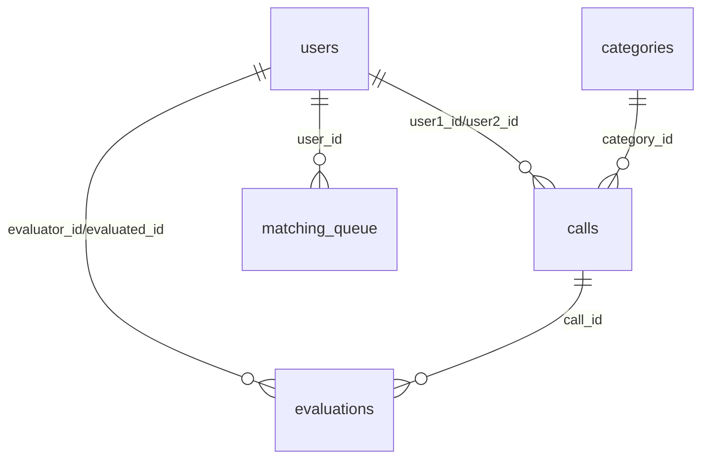
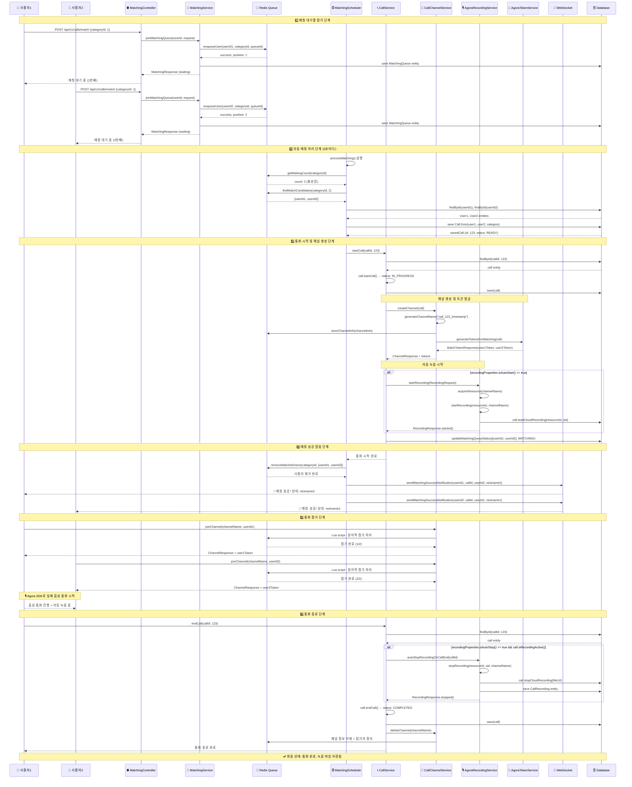

# 🎯 통화 앱 백엔드

실시간 매칭 기반 음성 통화 플랫폼의 백엔드 API 서버입니다.

## 📋 프로젝트 개요

사용자들이 관심사 기반으로 매칭되어 음성 통화를 할 수 있는 모바일 앱의 백엔드 시스템입니다. React Native 프론트엔드와 연동되며, 실시간 매칭, 통화 관리, 평가 시스템 등의 기능을 제공합니다.

### 🔧 기술 스택

- **Framework**: Spring Boot 3.x + WebFlux
- **Database**: MySQL 8.0 (Aiven/AWS RDS)
- **Cache/Queue**: Redis 7.0
- **Authentication**: JWT + OAuth2 (Kakao, Google)
- **Call Service**: Twilio/SignalWire
- **Build Tool**: Gradle
- **Java Version**: 17+

## 🚀 빠른 시작

### 1. 저장소 클론 및 환경 설정

```bash
# 저장소 클론
git clone [repository-url]
cd voicecall-backend

# Docker 환경변수 설정
cd docker
cp .env.example .env
# .env 파일을 열어서 실제 비밀번호로 수정하세요
```

### 2. 로컬 개발 환경 시작

```bash
# Docker 인프라 시작 (MySQL + Redis)
docker-compose up -d

# 컨테이너 상태 확인
docker-compose ps

# Spring Boot 애플리케이션 실행
cd ..
./gradlew bootRun --args='--spring.profiles.active=local'
```

### 3. 서버 확인

- API 서버: http://localhost:8080
- Redis Commander: http://localhost:8081 (Redis 관리 UI)

## 📁 프로젝트 구조 (DDD 기반)

```
chingoo-haja-backend/
├── src/main/java/com/ldsilver/chingoohaja
│   ├── domain/                           # 🏛️ 도메인 (Entity + Enum)
│   │   ├── user/                         # User, UserProfile, Gender, UserType
│   │   ├── call/                         # Call, Category, CallType, CallStatus  
│   │   ├── matching/                     # MatchingQueue, QueueStatus
│   │   ├── feedback/                     # Evaluation, FeedbackType
│   │   ├── friendship/                   # Friendship, FriendshipStatus
│   │   ├── guardian/                     # GuardianRelationship, RelationshipStatus
│   │   └── common/                       # BaseEntity, 공통 Enum/Exception
│   │
│   ├── service/                          # 🎯 비즈니스 로직
│   │   ├── AuthService                   # 소셜로그인, JWT 관리
│   │   ├── UserService                   # 프로필 관리, 닉네임 생성
│   │   ├── MatchingService               # 매칭 대기열, 실시간 매칭
│   │   ├── CallService                   # 통화 세션, 시작/종료
│   │   ├── FeedbackService               # 평가, 신고, 차단
│   │   ├── FriendshipService             # 친구 요청/승인
│   │   └── NotificationService           # 보호자 알림
│   │
│   ├── repository/                       # 🗄️ 데이터 접근 (JPA Repository)
│   │   ├── UserRepository
│   │   ├── CallRepository  
│   │   ├── MatchingQueueRepository
│   │   ├── EvaluationRepository
│   │   ├── FriendshipRepository
│   │   └── GuardianRelationshipRepository
│   │
│   ├── controller/                       # 🌐 REST API
│   │   ├── AuthController                # /auth/** 
│   │   ├── UserController                # /users/**
│   │   ├── MatchingController            # /matching/**
│   │   ├── CallController                # /calls/**
│   │   ├── FeedbackController            # /feedback/**
│   │   ├── FriendshipController          # /friends/**
│   │   └── AdminController               # /admin/**
│   │
│   ├── infrastructure/                   # 🔧 외부 연동
│   │   ├── oauth/                        # KakaoOAuthClient, GoogleOAuthClient
│   │   ├── call/                         # TwilioCallClient
│   │   ├── sms/                          # SmsClient (보호자 알림)
│   │   ├── redis/                        # RedisMatchingQueue, RedisCache
│   │   └── websocket/                    # WebSocketHandler (실시간 알림)
│   │
│   ├── dto/                              # 📦 데이터 전송 객체
│   │   ├── request/                      # LoginRequest, ProfileRequest 등
│   │   ├── response/                     # TokenResponse, CallResponse 등
│   │   └── common/                       # ApiResponse, PageResponse
│   │
│   └── config/                           # ⚙️ 설정
│       ├── SecurityConfig               
│       ├── JpaConfig
│       ├── RedisConfig
│       └── WebSocketConfig
│
├── src/main/resources/
│   ├── application.yml                   # 공통 설정  
│   ├── application-local.yml             # 로컬 환경
│   ├── application-dev.yml               # 개발 환경
│   └── application-prod.yml              # 운영 환경
│
└── docker/
    ├── docker-compose.yml                # MySQL + Redis
    └── .env.example                      # 환경변수
```

## 🔧 환경별 설정

### 로컬 개발 (local)
- **MySQL**: Docker 컨테이너
- **Redis**: Docker 컨테이너
- **용도**: 개인 개발, 오프라인 작업

```bash
./gradlew bootRun --args='--spring.profiles.active=local'
```

### 개발 서버 (dev)
- **MySQL**: Aiven 클라우드
- **Redis**: Docker 컨테이너 (로컬)
- **용도**: 팀 협업, 통합 테스트

```bash
# Redis만 로컬에서 실행
docker-compose up -d redis

# 개발 환경으로 실행
./gradlew bootRun --args='--spring.profiles.active=dev'
```

### 운영 서버 (prod)
- **MySQL**: AWS RDS
- **Redis**: AWS ElastiCache
- **용도**: 실제 서비스 운영

```bash
./gradlew bootRun --args='--spring.profiles.active=prod'
```

## 📊 데이터베이스 스키마

### 주요 테이블

- `users`: 사용자 정보 (소셜 로그인, 프로필)
- `categories`: 통화 카테고리 (일상대화, 취미 등)
- `calls`: 통화 기록 및 상태 관리
- `matching_queue`: 실시간 매칭 대기열
- `evaluations`: 통화 평가 및 피드백
- `friendships`: 친구 관계 관리
- `guardian_relationships`: 보호자-시니어 관계

### ERD


## 통화관련 서비스간 관계 및 통합 플로우
```mermaid
graph TB
subgraph "🎯 매칭 레이어"
MS[MatchingService<br/>매칭 요청/취소/상태조회]
MSS[MatchingSchedulerService<br/>자동 매칭 처리]
RMQS[RedisMatchingQueueService<br/>Redis 큐 관리]
end

    subgraph "📞 통화 레이어"
        CS[CallService<br/>통화 시작/종료<br/>자동 녹음 관리]
        CCS[CallChannelService<br/>Agora 채널 관리]
        ARS[AgoraRecordingService<br/>Cloud Recording]
    end
    
    subgraph "🔧 인프라 레이어"
        ATS[AgoraTokenService<br/>토큰 생성]
        WSE[WebSocketEventService<br/>실시간 알림]
        Redis[(Redis<br/>매칭 큐)]
        DB[(Database<br/>Call/Queue)]
    end
    
    %% 의존성 관계
    MS --> RMQS
    MSS --> RMQS
    MSS --> CS
    MSS --> WSE
    MSS --> DB
    
    CS --> CCS
    CS --> ARS
    CS --> DB
    
    CCS --> ATS
    CCS --> Redis
    
    RMQS --> Redis
    
    %% 스타일링
    classDef matching fill:#e1f5fe
    classDef call fill:#f3e5f5
    classDef infra fill:#e8f5e8
    
    class MS,MSS,RMQS matching
    class CS,CCS,ARS call
    class ATS,WSE,Redis,DB infra
```

## 매칭부터 통화까지 전체 플로우


## 🔌 주요 API 엔드포인트

### 인증
- `POST /api/v1/auth/oauth/{provider}` - 소셜 로그인
- `POST /api/v1/auth/refresh` - 토큰 갱신
- `POST /api/v1/auth/logout` - 로그아웃

### 사용자 관리
- `GET /api/v1/users/profile` - 프로필 조회
- `PUT /api/v1/users/profile` - 프로필 수정
- `POST /api/v1/users/profile/image` - 프로필 이미지 업로드

### 매칭 및 통화
- `POST /api/v1/calls/match` - 매칭 대기열 참가
- `GET /api/v1/calls/match/status` - 매칭 상태 조회
- `PUT /api/v1/calls/{callId}/start` - 통화 시작
- `PUT /api/v1/calls/{callId}/end` - 통화 종료
- `GET /api/v1/calls/history` - 통화 내역

### 평가 및 친구
- `POST /api/v1/evaluations` - 통화 평가 제출
- `POST /api/v1/friends/request` - 친구 요청
- `GET /api/v1/friends` - 친구 목록

## 🔄 실시간 기능

### WebSocket 연결
```
WebSocket URL: ws://localhost:8080/ws
Headers: Authorization: Bearer {jwt_token}
```

### 구독 토픽
- `/topic/calls/{userId}` - 매칭 성공 알림
- `/topic/call/{callId}` - 통화 상태 변경
- `/topic/friends/{userId}` - 친구 요청 알림

## 🧪 테스트

### 단위 테스트
```bash
./gradlew test
```

### 통합 테스트 (테스트 DB 사용)
```bash
# 테스트용 Docker 환경 실행
docker-compose -f docker/docker-compose.test.yml up -d

# 테스트 실행
./gradlew test -Dspring.profiles.active=test

# 정리
docker-compose -f docker/docker-compose.test.yml down -v
```

## 🔨 개발 도구

### Docker 관리
```bash
# 전체 로그 확인
docker-compose logs -f

# MySQL 접속
docker exec -it voicecall-mysql-local mysql -u voicecall_local_user -p

# Redis 접속
docker exec -it voicecall-redis redis-cli
# > AUTH redispassword

# 컨테이너 재시작
docker-compose restart

# 완전 초기화 (데이터 삭제)
docker-compose down -v
```

### 데이터베이스 관리
- **MySQL**: DBeaver, MySQL Workbench
- **Redis**: Redis Commander (http://localhost:8081)

## 🚨 트러블슈팅

### 자주 발생하는 문제

#### 1. MySQL 연결 실패
```bash
# 증상: Access denied for user 'voicecall_local_user'@'192.168.65.1'
# 해결:
docker-compose down -v
docker-compose up -d
```

#### 2. 포트 충돌
```bash
# 증상: Port 3306 is already allocated
# 해결: 로컬 MySQL 중지 또는 포트 변경
sudo service mysql stop
# 또는 docker-compose.yml에서 포트 변경: "3307:3306"
```

#### 3. Redis 연결 실패
```bash
# Redis 컨테이너 상태 확인
docker-compose logs redis

# Redis 재시작
docker-compose restart redis
```

### 로그 확인
```bash
# Spring Boot 로그 레벨 설정 (application-local.yml)
logging:
  level:
    com.voicecall: DEBUG
    org.hibernate.SQL: DEBUG
```

## 📈 개발 로드맵

### Phase 1: 기반 설정 ✅
- [x] 프로젝트 초기 설정
- [x] Docker Compose 환경 구성
- [x] JPA Entity 설계

### Phase 2: 인증 시스템 🔄
- [ ] JWT 토큰 시스템
- [ ] 소셜 로그인 (Kakao, Google)
- [ ] Spring Security 설정

### Phase 3: 사용자 관리 📋
- [ ] 사용자 프로필 관리
- [ ] 카테고리 시스템
- [ ] 프로필 이미지 업로드

### Phase 4: 매칭 시스템 🎯
- [ ] Redis 기반 매칭 큐
- [ ] 실시간 매칭 엔진
- [ ] WebSocket 알림

### Phase 5: 통화 관리 📞
- [ ] 외부 통화 API 연동
- [ ] 통화 상태 관리
- [ ] 통화 내역

### Phase 6: 부가 기능 ⭐
- [ ] 평가 시스템
- [ ] 친구 시스템
- [ ] 통계 및 알림

## 🤝 기여 가이드

### 커밋 컨벤션
```
feat: 새로운 기능 추가
fix: 버그 수정
docs: 문서 수정
style: 코드 포맷팅
refactor: 코드 리팩토링
test: 테스트 추가/수정
chore: 빌드 설정 등
```

### 브랜치 전략
```
main: 운영 배포용
develop: 개발 통합 브랜치
feature/기능명: 기능 개발 브랜치
hotfix/이슈명: 긴급 수정
```

## 📝 라이선스

This project is licensed under the MIT License.

## 📞 연락처

프로젝트 관련 문의사항이 있으시면 언제든 연락주세요.

---

**Happy Coding! 🚀**