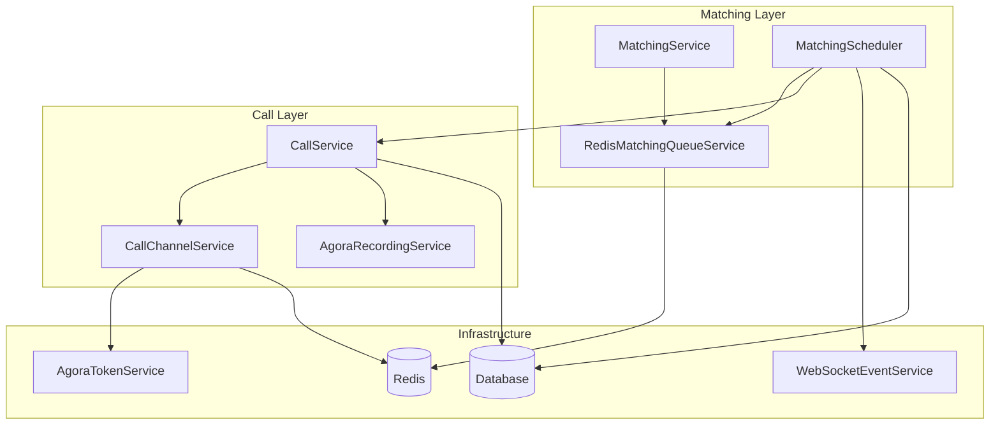
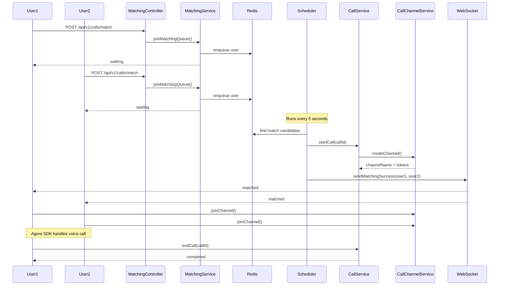

# Chingoo-Haja Backend

관심사 기반 실시간 음성 통화 매칭 플랫폼의 백엔드 API 서버입니다.

## Tech Stack

| Category | Technology |
|----------|-----------|
| Framework | Spring Boot 3.5.3 |
| Language | Java 17 |
| Database | MySQL 8.0 |
| Cache / Queue | Redis 7.0 |
| ORM | Spring Data JPA (Hibernate 6) |
| Authentication | JWT + OAuth2 (Kakao, Google) |
| Voice Service | Agora RTC + Cloud Recording |
| Storage | Firebase Admin SDK |
| Real-time | WebSocket (STOMP) |
| Build Tool | Gradle |

## Project Structure

계층 분리 기반의 레이어드 아키텍처를 따르며, 도메인 모델을 중심으로 구성되어 있습니다.

```
src/main/java/com/ldsilver/chingoohaja/
├── domain/           # Entity, Enum
│   ├── call/
│   ├── user/
│   ├── matching/
│   ├── category/
│   ├── evaluation/
│   ├── friendship/
│   ├── guardian/
│   └── common/
├── service/          # Business logic
├── repository/       # Spring Data JPA
├── controller/       # REST API
├── infrastructure/   # External integrations (OAuth, JWT, Agora, Redis)
├── config/           # Spring configuration
├── dto/              # Request / Response objects
└── scheduler/        # Matching scheduler
```

## Getting Started

### Prerequisites

- Java 17
- Docker & Docker Compose

### Local Development

```bash
# 1. Clone the repository
git clone <repository-url>
cd chingoo-haja

# 2. Set up environment variables
cd docker
cp .env.example .env
# Edit .env with your credentials

# 3. Start infrastructure (MySQL + Redis)
docker-compose up -d

# 4. Run the application
cd ..
./gradlew bootRun --args='--spring.profiles.active=local'
```

The server starts at `http://localhost:8080`.

## Environment Profiles

| Profile | Database | Redis | Usage |
|---------|----------|-------|-------|
| `local` | Docker (localhost:3306) | Docker (localhost:6379) | Local development |
| `dev` | Cloud (Aiven) | Docker local | Team integration |
| `prod` | AWS RDS | AWS ElastiCache | Production |
| `test` | H2 in-memory | localhost:6379 | Automated tests |

## Database Schema

| Table | Description |
|-------|-------------|
| `users` | 사용자 정보, 소셜 로그인, 프로필 |
| `user_tokens` | JWT 리프레시 토큰 |
| `categories` | 통화 카테고리 |
| `calls` | 통화 기록 및 상태 |
| `matching_queue` | 실시간 매칭 대기열 |
| `evaluations` | 통화 평가 및 피드백 |
| `friendships` | 친구 관계 |
| `guardian_relationships` | 보호자-시니어 관계 |


## Architecture

### Service Layer Overview



### Matching & Call Flow



## API Endpoints

전체 API 명세는 Swagger UI에서 확인할 수 있습니다.
**[https://api.chingoohaja.app/swagger-ui/index.html#/](https://api.chingoohaja.app/swagger-ui/index.html#/)**

아래는 핵심 플로우에 해당하는 주요 엔드포인트입니다.

### Authentication
| Method | Endpoint | Description |
|--------|----------|-------------|
| POST | `/api/v1/auth/oauth/{provider}` | 소셜 로그인 (kakao, google) |
| POST | `/api/v1/auth/oauth/kakao/native` | 카카오 네이티브 로그인 |
| POST | `/api/v1/auth/refresh` | 토큰 갱신 |
| POST | `/api/v1/auth/logout` | 로그아웃 |

### Users
| Method | Endpoint | Description |
|--------|----------|-------------|
| GET | `/api/v1/users/profile` | 프로필 조회 |
| PUT | `/api/v1/users/profile` | 프로필 수정 |
| POST | `/api/v1/users/profile/image` | 프로필 이미지 업로드 |

### Matching
| Method | Endpoint | Description |
|--------|----------|-------------|
| POST | `/api/v1/calls/match` | 매칭 대기열 참가 |
| GET | `/api/v1/calls/match/status` | 매칭 상태 조회 |
| DELETE | `/api/v1/calls/match` | 매칭 취소 |

### Calls
| Method | Endpoint | Description |
|--------|----------|-------------|
| GET | `/api/v1/calls/{callId}/status` | 통화 상태 조회 |
| POST | `/api/v1/calls/{callId}/end` | 통화 종료 |
| POST | `/api/v1/calls/{callId}/channel/join` | 채널 참가 (Agora 토큰 발급) |
| POST | `/api/v1/calls/{callId}/channel/leave` | 채널 퇴장 |

### Social
| Method | Endpoint | Description |
|--------|----------|-------------|
| POST | `/api/v1/evaluations` | 통화 평가 제출 |
| GET | `/api/v1/friendships` | 친구 목록 조회 |
| POST | `/api/v1/friendships` | 친구 요청 |
| POST | `/api/v1/reports/users/{reportedUserId}` | 사용자 신고 |

## WebSocket

```
URL: ws://{host}/ws
Header: Authorization: Bearer {jwt_token}
```

| Topic | Event |
|-------|-------|
| `/topic/calls/{userId}` | 매칭 성공 알림 |
| `/topic/call/{callId}` | 통화 상태 변경 |
| `/topic/friends/{userId}` | 친구 요청 알림 |

## Testing

```bash
# Run all tests
./gradlew test

# Run with test profile
./gradlew test -Dspring.profiles.active=test
```

Tests use an H2 in-memory database (MySQL-compatible mode). No external services are required.

## Commit Convention

```
feat:     새로운 기능 추가
fix:      버그 수정
docs:     문서 수정
style:    코드 포맷팅
refactor: 코드 리팩토링
test:     테스트 추가/수정
chore:    빌드 설정 등
```

## Branch Strategy

```
main:                          운영 배포
develop:                       개발 통합
feature/{이슈번호}-{도메인}:    기능 개발
refactor/{이슈번호}-{도메인}:   코드 리팩토링
bug/{이슈번호}-{도메인}:        버그 수정
```
